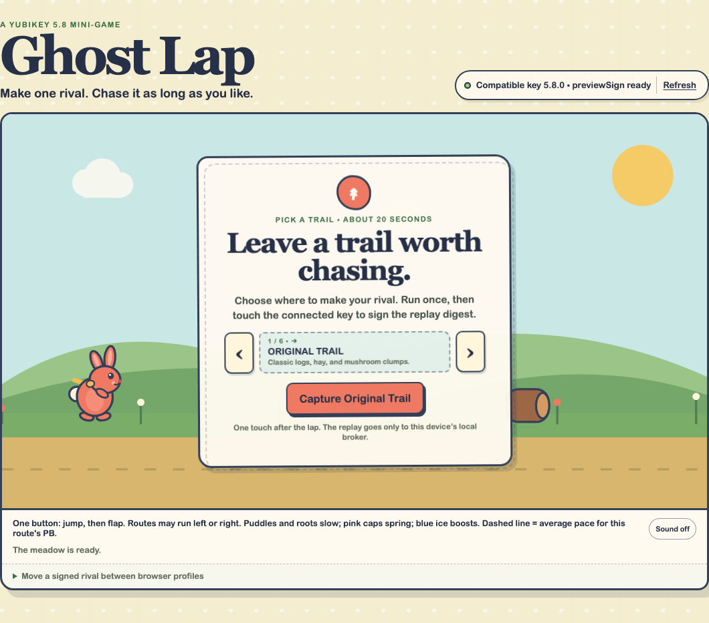
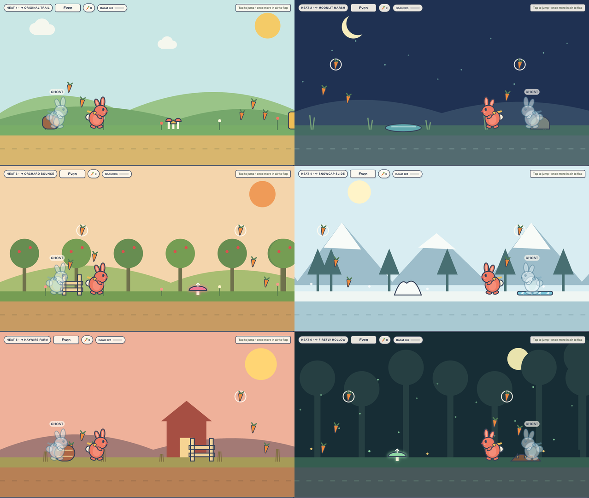
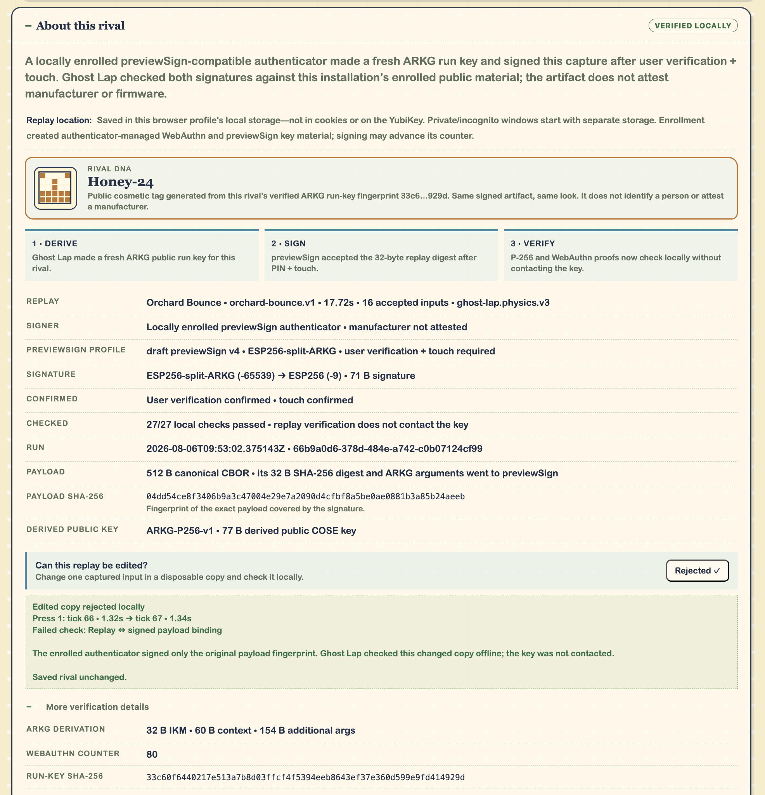

# Ghost Lap

**Run once. Sign once. Race your past self.**

Ghost Lap is a one-button runner where a YubiKey turns one captured lap into a
tamper-evident rival. Enter your FIDO PIN, touch the key once, then race that
same signed ghost as many times as you want.



## Project title and description

Pick one of six trails, then use Space, Up, click, or tap to jump and flap.
Collect three carrots for a speed burst, dodge the scenery, and reach the clock
before your rival.

Your first finish is the capture lap. Ghost Lap saves its accepted input ticks,
asks for a PIN and physical touch, and installs the resulting signed replay as
your rival. Ordinary races do not ask you to touch the key again.

The replay loop has six distinct routes, route medals, streaks, best times, a
physics-reconstructed **PB Echo**, and deterministic **Rival DNA** derived from
the signed run's public key. A new personal best becomes the signed rival only
when you explicitly promote it with another PIN and touch.



## What problem you're solving

Most hardware-key demos end at “you logged in.” Ghost Lap uses hardware trust
to create something the application keeps: a durable game object whose exact
captured inputs cannot be silently edited.

Replay is useful here, not suspicious. The key matters during one memorable
ceremony, then gets out of the way while the player keeps racing.

## How you used YubiKey 5.8 specific feature

Ghost Lap uses the experimental WebAuthn `previewSign` extension with the
**ESP256-split-ARKG** profile.

During local enrollment, it creates a normal WebAuthn credential plus an ARKG
master public seed and key handle. When a lap is signed, the local broker:

1. Validates the versioned route, 50 Hz finish tick, and accepted `press_ticks`.
2. Encodes that replay and pinned signer metadata as canonical CBOR.
3. Uses fresh 32-byte input keying material to derive a payload-bound P-256 run key.
4. Sends `SHA-256(payload)` to `previewSign`, requiring user verification and touch.
5. Verifies both that signature and a payload-bound normal WebAuthn assertion.

The run-key fingerprint also drives the rival's name, palette, marking, and
particle trail without making a new identity claim.

The signature covers the baseline route, input ticks, finish tick, and signer
metadata. Later route adaptations, scores, medals, streaks, and PB Echoes are
local game state and are not signed.



*Changing one accepted input from 1.32s to 1.34s breaks the signed replay
binding and is rejected locally without contacting the YubiKey.*

## Setup & run instructions

You need [`uv`](https://docs.astral.sh/uv/), one USB YubiKey 5.8 with a FIDO2
PIN, and a current desktop browser. `uv` installs compatible Python if needed
and fetches the locked dependencies on first launch.

macOS or Linux:

```bash
./scripts/run-local.sh
```

Windows PowerShell:

```powershell
.\scripts\run-local.ps1
```

The launcher downloads the locked Python environment and opens
<http://localhost:8788> when the server is ready. Then:

1. Connect exactly one compatible YubiKey.
2. Enroll Ghost Lap with your PIN and a touch.
3. Pick a trail and finish the capture lap.
4. Enter the PIN and touch once more to make the rival.

The broker auto-discovers USB FIDO devices and talks CTAP over the operating
system's HID path, so there is no browser “connect to YubiKey” popup. Linux may
need FIDO udev permissions; Windows may require an Administrator PowerShell for
direct HID access. This prototype is desktop USB only, not mobile or NFC.

If the key has no FIDO2 PIN, the setup card provides Yubico Authenticator
instructions and copyable one-time launcher commands. Normal launches cannot
set an initial FIDO PIN, and Ghost Lap never changes an existing PIN.

To play without hardware, start the clearly labelled software practice mode:

```bash
./scripts/run-mock.sh       # macOS or Linux
```

```powershell
.\scripts\run-mock.ps1     # Windows
```

## Tech stack & dependencies

- Responsive Canvas game in dependency-free HTML, CSS, and JavaScript
- FastAPI and Uvicorn local broker
- `python-fido2` 2.2.1 for direct authenticator access
- `cryptography` for ARKG-derived P-256 and WebAuthn verification
- `cbor2` for deterministic canonical CBOR
- SQLite for local enrollment; `localStorage` for rivals and game progress

The deterministic runner uses fixed 20 ms ticks and stores inputs rather than
per-frame positions.

## Security boundary

Ghost Lap proves that the locally enrolled signer accepted the exact baseline
replay after PIN verification and physical touch. It does not prove honest play.

- The browser, operating system, and local broker are trusted.
- Later results and progression are unsigned.
- Enrollment does not establish Yubico manufacturer or firmware attestation.
- Exported proof JSON contains public, linkable credential material and verifies
  only against the matching local enrollment.
- Loopback and origin checks block ordinary cross-site requests, not hostile
  native software on the same machine.
- `previewSign`, ARKG drafts, and their identifiers remain experimental.

## References and asset credit

- [YubicoLabs `build-with-us` samples](https://github.com/YubicoLabs/build-with-us)
- [Yubico Python ARKG / `previewSign` example](https://github.com/YubicoLabs/build-with-us/blob/main/quickstart/python/example_arkg.py)
- [Yubico CTAP 2.3 developer guide](https://developers.yubico.com/CTAP/CTAP2.3.html)
- [WebAuthn `previewSign` draft](https://yubicolabs.github.io/webauthn-sign-extension/4/)
- [ARKG draft](https://datatracker.ietf.org/doc/draft-bradleylundberg-cfrg-arkg/)

The brief late-rabbit cameo uses the image from the Reddit post
[“What does this mean? I see it everywhere?”](https://www.reddit.com/r/PeterExplainsTheJoke/comments/1ocsaox/what_does_this_mean_i_see_it_everywhere/).
Rights remain with the original creator.
